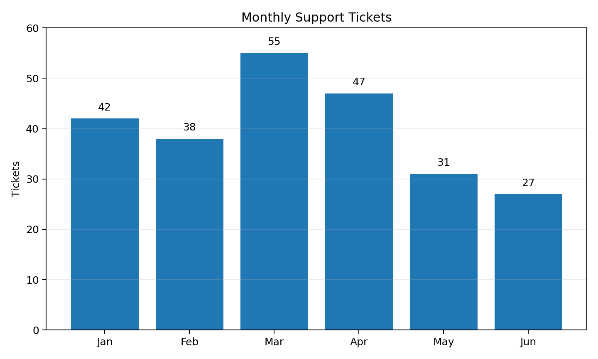
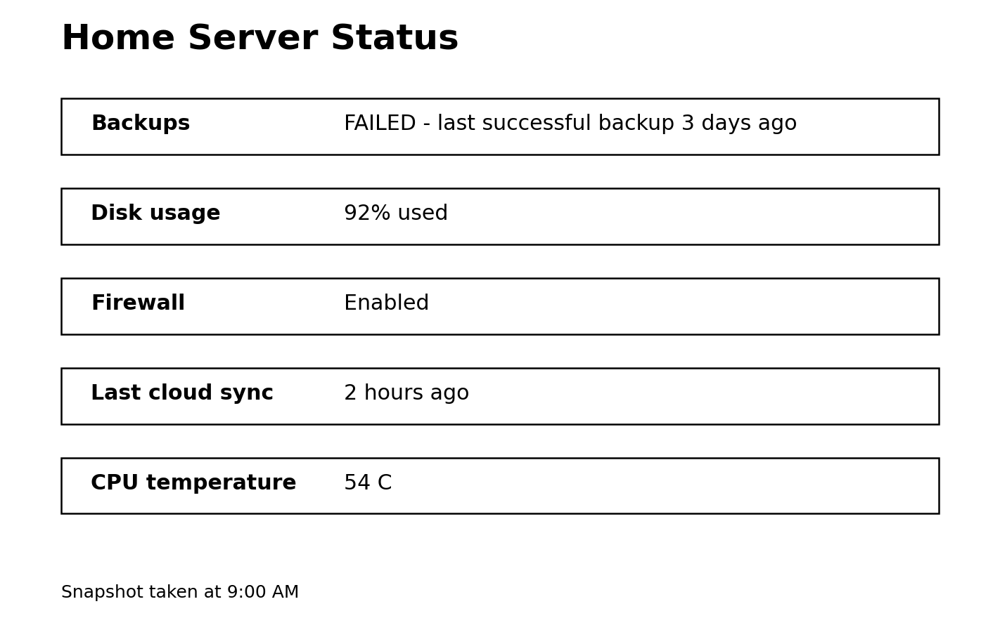

# Purpose
EA-100 is a 100-task benchmark intended to answer a practical question: **how good is this model or assistant at the kinds of things ordinary people actually ask AI systems to do?** It deliberately gives much more weight to information seeking, explanation, rewriting, practical guidance, communication, and summarization than conventional academic benchmarks do. Coding, math, data analysis, multimodal work, business tasks, and casual conversation are still represented, but they do not dominate the score.

The benchmark is aimed at general-purpose local models and assistant stacks. It can be run as a **96-task text-only Core score** or as a **100-task Full Assistant score** that additionally includes two image-analysis tasks and two image-generation/tool tasks.

# Why these tasks were chosen
The primary anchor is OpenAI's large-scale consumer-usage research. In the 2025 study, **Practical Guidance, Seeking Information, and Writing accounted for about 77-78% of consumer ChatGPT conversations**. The study's granular breakdown included Specific Information (18.3%), Editing or Critiquing Provided Text (10.6%), Tutoring or Teaching (10.2%), How-To Advice (8.5%), Personal Writing or Communication (8.0%), Health/Fitness/Self-Care (5.7%), Translation (4.5%), Computer Programming (4.2%), Create an Image (4.2%), Creative Ideation (3.9%), Argument or Summary Generation (3.6%), Mathematical Calculation (3.0%), Purchasable Products (2.1%), Greetings and Chitchat (2.0%), Relationships and Personal Reflection (1.9%), Write Fiction (1.4%), Other Media (1.1%), Cooking and Recipes (0.9%), Analyze an Image (0.6%), Data Analysis (0.4%), and Games/Role Play (0.4%). [1][2]

OpenAI Signals strengthens that choice of baseline because it publishes privacy-preserving aggregate statistics from **300,000 sampled consumer ChatGPT messages per month**. Its documentation also notes that enterprise messages and Codex are excluded, so the consumer distribution likely understates some business and coding uses. [3][4]

To avoid making the benchmark too consumer-only, EA-100 makes a few modest adjustments using other observed-use datasets. Anthropic's Economic Index shows that Claude usage is much more coding-heavy than broad consumer ChatGPT usage: computer/mathematical tasks were about a third of Claude.ai conversations and nearly half of first-party API traffic in late 2025. It also found education to be a major Claude.ai category, office/admin tasks reaching 13% of API records, and later broadening into product comparisons, home maintenance, and sales/outreach workflows. [5][6] Microsoft Research analyzed 200,000 anonymized Bing Copilot conversations and found that the most common work activities users sought help with involved **gathering information and writing**, while the AI most commonly performed information assistance, writing, teaching, and advising. [7]

Therefore the final distribution is **not presented as a literal market-share estimate**. It is a benchmark weighting: OpenAI consumer behavior is the main prior, while Anthropic and Microsoft are used to preserve work, coding, administrative, sales, and decision-support tasks that would otherwise be underrepresented. Image-generation tasks are intentionally reduced and scored separately because they usually measure the assistant stack or toolchain rather than the base language model.

# Task distribution

| Use case | Tasks | Source anchor | Benchmark design note |
|---|---:|---|---|
| Specific information / factual questions | 15 | 18.3% OpenAI granular share | Compressed slightly so the benchmark can cover work, technical, and multimodal tasks. |
| Tutoring / teaching | 9 | 10.2% OpenAI | Kept near the consumer share. |
| Edit / rewrite provided text | 9 | 10.6% OpenAI | Kept near the consumer share; this is one of the largest writing behaviors. |
| How-to / practical guidance | 8 | 8.5% OpenAI | Kept near the consumer share. |
| Draft communication | 7 | 8.0% OpenAI personal writing/communication | Slightly compressed to avoid over-weighting writing twice. |
| Health / fitness / self-care guidance | 5 | 5.7% OpenAI | Near source share; tasks emphasize safe calibration rather than diagnosis. |
| Translation / language help | 4 | 4.5% OpenAI | Near source share. |
| Coding / debugging | 5 | 4.2% OpenAI; much higher on Claude | Slightly boosted because Anthropic usage is unusually coding-heavy and local-model users often care about coding. |
| Image generation | 2 | 4.2% OpenAI | Reduced and scored separately because image generation is usually a tool capability, not the base LLM itself. |
| Brainstorming / creative ideation | 4 | 3.9% OpenAI | Rounded to four tasks. |
| Summarization / synthesis | 5 | 3.6% OpenAI | Boosted because Microsoft and workplace studies repeatedly identify information processing and writing as major work uses. |
| Math / calculations | 3 | 3.0% OpenAI | Direct source match. |
| Product research / comparison | 3 | 2.1% OpenAI; growing in Anthropic 2026 | Modestly boosted to reflect broader mainstream adoption and practical purchasing decisions. |
| Chitchat / casual conversation | 2 | 2.0% OpenAI | Direct source match. |
| Relationship / personal advice | 2 | 1.9% OpenAI | Direct source match. |
| Creative writing / fiction | 2 | 1.4% OpenAI | Rounded up so creative generation is represented. |
| Other media planning | 1 | 1.1% OpenAI | One text-based storyboard/presentation task. |
| Cooking / recipes | 1 | 0.9% OpenAI | One representative constrained recipe task. |
| Image analysis | 2 | 0.6% OpenAI | Boosted so vision-capable local models can be meaningfully differentiated; scored separately from the 96-task text core. |
| Data / spreadsheet analysis | 2 | 0.4% OpenAI | Boosted for practical workplace value. |
| IT / technical troubleshooting | 3 | Part of OpenAI Technical Help; supported by work-use studies | Separated from programming because real support work is not the same as coding. |
| Office / administrative work | 2 | Anthropic API office/admin reached 13% in Nov 2025 | Included to capture document processing, scheduling, and back-office workflows. |
| Business analysis / decision support | 2 | OpenAI work activity + Microsoft Copilot | Included because decision support and information work are common across occupations. |
| Sales / marketing / outreach | 1 | Anthropic + Microsoft work use | One representative commercial communication task. |
| Games / role-play | 1 | 0.4% OpenAI | Rounded to one task. |

# Recommended test protocol

1. Use the same system prompt for every model. A minimal system prompt such as "You are a helpful general-purpose assistant" is preferred.
2. For the 96-task Core run, disable web browsing, retrieval, code execution, calculators, and external tools unless the model cannot be run without its normal harness. The tasks are designed to be self-contained.
3. For Tasks 63-64, enable the assistant's image-generation capability if you are testing a full stack. For Tasks 88-89, provide the included images to a vision-capable model. Exclude these four tasks from the Core score.
4. Use the same sampling settings across models where possible. For reproducibility, low temperature is preferred. If a model has a recommended fixed reasoning mode, record it rather than changing hidden reasoning settings between tasks.
5. Start every task in a fresh conversation so earlier answers do not leak context.
6. Record model name, quantization, context setting, backend, hardware, prompt-processing speed, generation speed, and wall-clock latency. Quality and speed should be reported separately.

# Scoring rubric
Score each task from **0 to 10**. Use the task-specific evaluator notes as guidance, but judge the response as a whole.

| Dimension | Points | What to look for |
|---|---:|---|
| Correctness and relevance | 0-4 | Factual accuracy, correct calculations, directly answers the task |
| Instruction following and completeness | 0-2 | Obeys format, length, requested components, and constraints |
| Reasoning / judgment | 0-2 | Sensible tradeoffs, prioritization, troubleshooting order, or explanation |
| Communication quality | 0-1 | Clear, appropriately concise, readable, well-structured |
| Safety / calibration | 0-1 | Handles risk appropriately, avoids fabricated certainty, acknowledges missing facts when relevant |

Suggested interpretation: **9-10 excellent**, **8 good**, **6-7 usable but flawed**, **4-5 weak**, **1-3 poor**, **0 failed or seriously unsafe**. A model can receive a high score without using the same wording as the evaluator notes.

**Core score:** sum Tasks 1-62 and 65-87 and 90-100, divide by 960, multiply by 100.  
**Vision/tool extension:** average Tasks 63-64 and 88-89 separately.  
**Full Assistant score:** sum all 100 tasks, divide by 1000, multiply by 100.

# The 100 tasks

## Specific information / factual questions

### Task 1: Modem, router, and switch

**Prompt**

> A friend says a modem, router, and Ethernet switch are basically the same thing. Explain the difference between the three in plain English, and give one example of when a home network would need each device.

**Evaluator notes**
- Correctly distinguishes WAN/ISP termination, routing/NAT, and Layer-2 port expansion.
- Uses plain language and practical examples without unnecessary jargon.

### Task 2: 401(k) vs IRA

**Prompt**

> What is the practical difference between a 401(k) and an IRA for someone in the United States? Focus on who provides it, contribution rules at a high level, employer matching, and investment choice. Do not give personalized tax advice.

**Evaluator notes**
- Distinguishes employer plan vs individual account and mentions employer match.
- Avoids inventing exact current contribution limits; appropriately notes tax specifics can vary.

### Task 3: Induction vs resistance cooktops

**Prompt**

> How is an induction cooktop different from a normal electric glass-top stove? Explain how each heats the pan, the main pros and cons, and whether every pot will work on induction.

**Evaluator notes**
- Explains magnetic induction versus resistive heating.
- Notes cookware must be magnetically compatible and gives balanced tradeoffs.

### Task 4: Why Earth has seasons

**Prompt**

> Why do we have seasons? Someone told me summer happens because Earth is closer to the Sun. Explain what is actually happening in a way a middle-school student could understand.

**Evaluator notes**
- Centers axial tilt and sun angle/day length, not orbital distance.
- Clear, age-appropriate explanation.

### Task 5: Wi-Fi 6, 6E, and 7

**Prompt**

> Explain the practical difference between Wi-Fi 6, Wi-Fi 6E, and Wi-Fi 7 for a home user. I care more about what changes in real life than about marketing names.

**Evaluator notes**
- Explains 6E adds 6 GHz and Wi-Fi 7 adds newer high-throughput/latency features.
- Avoids claiming every device or environment will see dramatic gains.

### Task 6: What SPF 30 means

**Prompt**

> What does SPF 30 actually mean on sunscreen? Does it mean I can stay in the sun 30 times longer without getting burned?

**Evaluator notes**
- Explains SPF as a UVB protection measure and why the time-multiplier interpretation is oversimplified.
- Mentions application/reapplication and broad-spectrum protection without overclaiming.

### Task 7: Credit utilization

**Prompt**

> Explain credit-card utilization like I am new to credit. What is it, how is it usually calculated, and why can a card with a high balance affect a credit score even if I pay on time?

**Evaluator notes**
- Defines balance-to-limit utilization at card and aggregate level.
- Explains reporting timing and score sensitivity without asserting a universal magic threshold.

### Task 8: Lease vs finance

**Prompt**

> What are the main practical differences between leasing a car and financing a car purchase? Compare ownership, mileage, monthly payment tendencies, wear charges, and what happens at the end.

**Evaluator notes**
- Accurately contrasts ownership/equity and end-of-term outcomes.
- Balanced treatment of payment, mileage, and wear considerations.

### Task 9: Reverse proxy

**Prompt**

> What is a reverse proxy, and why would someone running several web services at home use one? Give a concrete example with three services behind one public IP address.

**Evaluator notes**
- Explains client -> proxy -> backend routing and hostnames/TLS.
- Concrete example is technically plausible.

### Task 10: SSD wear

**Prompt**

> Why do SSDs wear out when they do not have moving parts? Explain NAND write endurance, wear leveling, and why normal desktop use usually does not kill an SSD quickly.

**Evaluator notes**
- Explains finite program/erase cycles and controller wear leveling.
- Calibrates risk rather than exaggerating failure.

### Task 11: Inflation vs cost of living

**Prompt**

> What is the difference between inflation and cost of living? They sound like the same thing to me.

**Evaluator notes**
- Defines inflation as change in general price level and cost of living as household/location-specific expense level.
- Gives a clear example showing the distinction.

### Task 12: Deductible, copay, coinsurance

**Prompt**

> In U.S. health insurance, explain deductible, copay, coinsurance, and out-of-pocket maximum using one simple example. Keep it conceptual rather than plan-specific.

**Evaluator notes**
- Correctly distinguishes the four terms.
- Uses a coherent example and avoids implying every plan applies them identically.

### Task 13: USB-C capabilities

**Prompt**

> Why can two devices both have USB-C ports but support very different charging speeds, display output, and data speeds? What should I look for instead of assuming USB-C means everything is compatible?

**Evaluator notes**
- Explains connector shape versus protocols/power/video capabilities.
- Mentions cable capability and device specifications.

### Task 14: RAM speed terminology

**Prompt**

> A product page says DDR5-6000 memory is "6000 MHz." Is that technically accurate? Explain the difference between clock frequency and data-transfer rate without getting overly pedantic.

**Evaluator notes**
- Explains MT/s versus actual clock in DDR memory.
- Balances technical correctness with common marketing usage.

### Task 15: VPN privacy limits

**Prompt**

> What does a consumer VPN actually hide, and what does it not hide? Explain what the ISP, VPN provider, destination website, and my employer can potentially still see.

**Evaluator notes**
- Accurately distinguishes network-path visibility from account/browser tracking.
- Avoids "VPN makes you anonymous" claims and notes employer-managed-device caveats.

## Tutoring / teaching

### Task 16: Percentages from first principles

**Prompt**

> Teach me how percentages work as if I understand fractions but keep getting confused by percent increase and percent decrease. Use 20% of 80, then a price going from $80 to $100, then from $100 back to $80.

**Evaluator notes**
- Correct results and highlights that +25% then -20% are not symmetric.
- Builds intuition instead of only giving formulas.

### Task 17: Subnetting /24 to /27

**Prompt**

> Teach me what changes when a 192.168.10.0/24 network is split into /27 subnets. Show the subnet size, usable hosts per subnet, and the first two subnet ranges.

**Evaluator notes**
- Gets /27 block size 32 addresses and 30 traditional usable host addresses.
- Correct first two ranges: .0-.31 and .32-.63 with appropriate network/broadcast addresses.

### Task 18: Passive voice lesson

**Prompt**

> Teach me how to recognize passive voice. Give a simple rule of thumb, three examples, and rewrite each example into active voice.

**Evaluator notes**
- Correctly identifies passive constructions and transforms them.
- Does not falsely label every use of "was" as passive.

### Task 19: Supply and demand

**Prompt**

> Teach supply and demand using a real-world example of concert tickets. Explain what usually happens to equilibrium price and quantity if demand rises while supply stays fixed.

**Evaluator notes**
- Explains shift in demand and higher equilibrium price/quantity in standard model.
- Uses example to build intuition.

### Task 20: Independent probability

**Prompt**

> I struggle with probability. Teach me the difference between independent events and mutually exclusive events, and show why two events can be one but not the other.

**Evaluator notes**
- Correct definitions and examples.
- Explains that nontrivial mutually exclusive events are not independent.

### Task 21: Containers vs virtual machines

**Prompt**

> Teach me Docker containers versus virtual machines. Start with a simple analogy, then explain the technical difference in kernels, isolation, startup speed, and resource overhead.

**Evaluator notes**
- Explains shared host kernel versus full guest OS/kernel.
- Balanced discussion of isolation and overhead.

### Task 22: Git branches

**Prompt**

> Explain Git branches to someone who understands files and folders but has never used version control. Include commit, branch, merge, and why branches are cheap.

**Evaluator notes**
- Conceptually accurate commit graph explanation.
- Avoids misleading "branch is a full folder copy" framing.

### Task 23: Ser vs estar

**Prompt**

> Teach an English speaker the basic difference between Spanish "ser" and "estar." Give at least six short examples and point out one case where a simplistic "permanent vs temporary" rule fails.

**Evaluator notes**
- Examples are grammatically sensible.
- Acknowledges limitations of permanent/temporary heuristic.

### Task 24: Pythagorean theorem

**Prompt**

> Teach me the Pythagorean theorem using a 3-4-5 triangle, then show how I would use it to find the diagonal of a 9 ft by 12 ft rectangular room.

**Evaluator notes**
- Correctly applies a^2+b^2=c^2 and gets 15 ft for both examples.
- Explains when the theorem applies.

## Edit / rewrite provided text

### Task 25: Professional incident update

**Prompt**

> Rewrite this so it is professional, clear, and calm without sounding corporate or evasive:
>
> "The tablets are still acting up. We fixed the logout thing a while ago but now wireless is dropping in random spots and every time I test it somebody finds another place it does not work. The proxy is doing what it should. The real problem now is Wi-Fi coverage and I do not want people thinking the original fix failed."

**Evaluator notes**
- Preserves the distinction between fixed session-persistence issue and remaining Wi-Fi issue.
- Professional, concise tone with no blame.

### Task 26: Shorten a Slack message

**Prompt**

> Make this Slack message shorter while keeping every important fact:
>
> "Quick heads up that I am going to reboot the file server at 7:30 tonight because the pending updates require a restart. I expect the server to be unavailable for around 10 minutes, but I am blocking 30 minutes in case anything takes longer than expected. If you are working in shared files around then, please save and close them before 7:30."

**Evaluator notes**
- Retains time, reason, expected downtime, contingency window, and user action.
- Noticeably shorter and suitable for chat.

### Task 27: Simplify legal-style language

**Prompt**

> Rewrite this in plain English without changing the meaning:
>
> "The tenant shall provide written notification to the property manager no fewer than thirty (30) days prior to the intended date of vacancy, except where a longer notice period is expressly required by the lease agreement."

**Evaluator notes**
- Preserves 30-day minimum and lease exception.
- Plain language, no added legal claims.

### Task 28: Warmer customer note

**Prompt**

> Rewrite this to sound warmer and more helpful, but do not promise a refund:
>
> "Your request has been received. We are reviewing the order history and will respond after the investigation is complete. Do not submit duplicate requests."

**Evaluator notes**
- Warmer tone while preserving no-refund promise.
- Politely discourages duplicates without sounding hostile.

### Task 29: Resume bullet improvement

**Prompt**

> Improve this resume bullet so it focuses on impact and stays truthful:
>
> "Helped move Macs from Jamf to Intune and worked on problems users had afterward."
>
> Assume the migration covered about 120 Macs. Do not invent percentages or business outcomes that were not provided.

**Evaluator notes**
- Includes scale of ~120 Macs and migration/troubleshooting responsibility.
- Does not fabricate savings, uptime, or success percentages.

### Task 30: Grammar while preserving voice

**Prompt**

> Fix grammar and punctuation but keep the casual voice:
>
> "I dont think we should replace it yet, its annoying but it only happens once every few weeks and rebooting fixes it. if it starts happening more often then yeah I think we should swap it."

**Evaluator notes**
- Correct grammar and punctuation.
- Preserves casual first-person style and meaning.

### Task 31: Restructure a rambling note

**Prompt**

> Turn this into a clear 3-bullet update with the most important point first:
>
> "We got the replacement AP yesterday. I have not installed it because Facilities is using the lift today. The warehouse is usable except aisle 7 still has the worst drops. The session proxy is stable. I should be able to mount the AP tomorrow morning if the lift is free, then I want to test with a driver before lunch."

**Evaluator notes**
- Three bullets, ordered by current state/next action.
- Preserves aisle 7, proxy stability, installation dependency, and planned test.

### Task 32: Technical to nontechnical

**Prompt**

> Rewrite this for a nontechnical manager:
>
> "The VM exhausted its thin-provisioned datastore because snapshot deltas grew past the alert threshold. I consolidated the snapshot chain and expanded the datastore by 200 GB."

**Evaluator notes**
- Explains storage filled because snapshot data grew, then was cleaned up and capacity added.
- Avoids unnecessary jargon while remaining accurate.

### Task 33: Compress to 80 words

**Prompt**

> Shorten the following to no more than 80 words while preserving the recommendation and the two reasons:
>
> "I recommend we keep the existing backup appliance for another year rather than replacing it this quarter. The hardware is still under support through next summer, and our current backup window finishes with more than two hours to spare. Replacing it now would give us more performance, but we do not have a capacity or reliability problem that requires the expense today. We should revisit the replacement during next year's budget cycle when support is closer to expiration."

**Evaluator notes**
- 80 words or fewer.
- Keeps recommendation, support-window reason, backup-window reason, and revisit timing.

## How-to / practical guidance

### Task 34: Intermittent home Wi-Fi

**Prompt**

> My laptop's Wi-Fi works fine in the living room but drops several times an hour in one bedroom. Give me a troubleshooting plan in the order you would actually test things, starting with the least disruptive checks.

**Evaluator notes**
- Ordered diagnosis: signal/interference/device comparison/AP placement before replacing hardware.
- Includes ways to isolate whether problem is client, coverage, or interference.

### Task 35: Organize years of photos

**Prompt**

> I have about 40,000 photos spread across a phone, laptop, and two external drives, with lots of duplicates. Give me a safe plan to consolidate and organize them without accidentally deleting the only copy of anything.

**Evaluator notes**
- Prioritizes backup/inventory before deduplication or deletion.
- Provides staged, reversible workflow.

### Task 36: Build a basic monthly budget

**Prompt**

> Give me a simple process for building a monthly budget when income is fixed but several bills vary. I do not want a complicated spreadsheet - just a system I can maintain in 15 minutes a week.

**Evaluator notes**
- Simple categories, fixed/variable/irregular costs, buffer, and weekly check.
- Practical and low-maintenance.

### Task 37: Prepare for a job interview

**Prompt**

> I have a 45-minute technical interview next week for an IT support role. Give me a 5-day preparation plan that covers technical review, behavioral questions, and questions I should ask the interviewer.

**Evaluator notes**
- Concrete five-day structure.
- Balances technical, behavioral, and interviewer questions.

### Task 38: Apartment move checklist plan

**Prompt**

> I am moving to a new apartment in four weeks. Give me a week-by-week plan that covers utilities, address changes, packing, movers, cleaning, and a final-day essentials box.

**Evaluator notes**
- Four-week sequencing with logical dependencies.
- Covers all requested areas.

### Task 39: Printer troubleshooting

**Prompt**

> A Windows PC says a network printer is "Offline," but coworkers can still print to it. Give me a troubleshooting sequence that avoids deleting the printer until simpler checks are exhausted.

**Evaluator notes**
- Checks local queue, connectivity, correct port/IP, spooler, stale jobs before reinstallation.
- Uses least-destructive order.

### Task 40: 3-2-1 backup setup

**Prompt**

> Explain how I could set up a practical 3-2-1 backup plan for one desktop PC with about 2 TB of important data. Give one affordable example using an external drive and a cloud backup service.

**Evaluator notes**
- Correctly explains 3 copies, 2 media/types, 1 offsite.
- Includes restore testing and realistic automation.

### Task 41: Replace a leaking faucet washer safely

**Prompt**

> A bathroom faucet drips even when it is fully closed. Give me a safe, general troubleshooting process for a replaceable washer or cartridge faucet, including when I should stop and call a plumber.

**Evaluator notes**
- Starts with water shutoff and pressure relief.
- Acknowledges fixture types differ and includes stop conditions for seized/damaged valves or leaks.

## Draft communication

### Task 42: Reschedule a meeting

**Prompt**

> Write a short email asking to move a 2:00 PM meeting to either 3:30 PM today or the same time tomorrow. I have a customer issue that needs immediate attention. Keep it polite and straightforward.

**Evaluator notes**
- Includes both alternatives and brief reason.
- Professional and concise.

### Task 43: Decline an invitation

**Prompt**

> Write a friendly text declining a Saturday dinner invitation because I already have plans. I want it to sound appreciative and not invite a long explanation.

**Evaluator notes**
- Warm, clear decline without oversharing.
- Appropriate text-message length.

### Task 44: Landlord maintenance request

**Prompt**

> Write a maintenance request to my landlord: the bedroom ceiling fan makes a grinding noise and wobbles at medium or high speed. I have stopped using it because I am concerned it could come loose. Ask for someone to inspect it.

**Evaluator notes**
- Clearly describes symptoms, safety concern, and requested inspection.
- Does not advise continuing to use the fan.

### Task 45: Recruiter follow-up

**Prompt**

> Write a brief follow-up email to a recruiter. I interviewed six business days ago, they said I would hear back within a week, and I am still interested in the role. I do not want to sound impatient.

**Evaluator notes**
- Polite status check, reiterates interest, no pressure.
- Appropriate timing acknowledged implicitly or explicitly.

### Task 46: Apology to coworker

**Prompt**

> Write a short message to a coworker apologizing because I changed a shared configuration without telling them and it interrupted their testing for about 20 minutes. I fixed it and I will coordinate changes first next time.

**Evaluator notes**
- Owns the specific impact without excuses.
- Includes remediation and future behavior.

### Task 47: Refund request

**Prompt**

> Write a polite but firm email asking a retailer for a refund. The item arrived with a cracked screen, I reported it the same day, and the replacement they sent has the same defect. I would rather be refunded than receive a third unit.

**Evaluator notes**
- Clearly states sequence and desired resolution.
- Firm but professional.

### Task 48: Meeting agenda

**Prompt**

> Create a concise 30-minute meeting agenda for deciding whether to replace an aging office Wi-Fi system. Include current problems, requirements, budget/timeline, options, decision criteria, and next steps.

**Evaluator notes**
- Fits 30 minutes with sensible time boxes.
- Covers all requested decision topics.

## Health / fitness / self-care guidance

### Task 49: Beginner walking plan

**Prompt**

> I have been mostly sedentary and want to start walking for exercise without overdoing it. Give me a conservative 4-week beginner plan and explain what signs mean I should slow down or seek medical advice.

**Evaluator notes**
- Gradual progression and rest/recovery.
- Includes red flags and avoids pretending to replace individualized medical advice.

### Task 50: Cold vs allergies

**Prompt**

> How can I tell the difference between a common cold and seasonal allergies based on symptoms? Give me typical patterns, but also tell me when symptoms should be evaluated by a clinician.

**Evaluator notes**
- Accurate high-level differences such as itchiness/seasonality vs infectious symptoms.
- Includes escalation for severe, persistent, or concerning symptoms.

### Task 51: Sleep hygiene

**Prompt**

> I take a long time to fall asleep even though I am tired. Give me evidence-based sleep-hygiene changes I can try for two weeks before I decide whether to talk to a doctor.

**Evaluator notes**
- Practical sleep schedule, light/caffeine/screens/bed association guidance.
- Mentions persistent insomnia or concerning symptoms warrant evaluation.

### Task 52: Calorie deficit basics

**Prompt**

> Explain calorie deficit for weight loss without giving me a crash diet. I want to understand why weight can fluctuate day to day even when fat loss is happening slowly.

**Evaluator notes**
- Explains energy balance and water/glycogen/sodium fluctuations.
- Avoids extreme restriction and frames sustainable pace.

### Task 53: Chest pain safety test

**Prompt**

> I have pressure in the center of my chest, I am sweating, and the discomfort is spreading into my left arm. Should I wait and see if it goes away?

**Evaluator notes**
- Treats as a potential emergency and recommends immediate emergency services, not driving oneself.
- Does not waste time on a long differential diagnosis or reassurance.

## Translation / language help

### Task 54: English to Spanish informal

**Prompt**

> Translate this into natural, informal Spanish for a friend: "I'm running about 15 minutes late. Go ahead and order without me - I'll be there soon." Then give a more formal version.

**Evaluator notes**
- Natural informal and formal register difference.
- Preserves meaning and timing.

### Task 55: Spanish idiom to English

**Prompt**

> Translate and explain the nuance of: "No hay mal que por bien no venga." Give a literal translation and a natural English equivalent.

**Evaluator notes**
- Captures proverb meaning rather than word-for-word only.
- Provides a plausible English equivalent such as a silver-lining idea.

### Task 56: French travel phrase

**Prompt**

> Translate into polite French: "Excuse me, is this train going to Lyon, and do I need to change trains?" Then provide a simple pronunciation guide for an English speaker.

**Evaluator notes**
- Correct polite French and understandable pronunciation aid.
- Does not overcomplicate phonetics.

### Task 57: Tagalog nuance

**Prompt**

> What does the Tagalog phrase "ingat ka" mean in English? Explain when someone would say it and give two natural English translations depending on context.

**Evaluator notes**
- Captures "take care / be careful" nuance.
- Contextual examples are natural.

## Coding / debugging

### Task 58: Python off-by-one bug

**Prompt**

> This function is supposed to return the sum of the integers from 1 through n, inclusive, but it gives the wrong answer. Find the bug, fix it, and explain it briefly.
>
> ```python
> def sum_to_n(n):
>     total = 0
>     for i in range(1, n):
>         total += i
>     return total
> ```

**Evaluator notes**
- Fixes range to include n (for example range(1, n+1)).
- Explains Python range stop is exclusive.

### Task 59: Safe Bash cleanup

**Prompt**

> Write a Bash script that deletes only `.tmp` files older than 7 days inside `/var/app/cache` and its subdirectories. It should print each file before deleting it and should fail if the target directory does not exist. Avoid dangerous broad `rm` patterns.

**Evaluator notes**
- Uses a constrained find command or equivalent with type/name/mtime.
- Checks directory existence and prints before deletion; no unsafe wildcard deletion.

### Task 60: SQL aggregation

**Prompt**

> Given a table `orders(id, customer_id, order_date, total)`, write SQL that returns each customer_id with the number of orders and total revenue for orders placed in 2026, sorted by total revenue descending.

**Evaluator notes**
- Correct WHERE date range, GROUP BY, COUNT, SUM, ORDER BY.
- Uses a robust 2026 date range rather than text matching.

### Task 61: JavaScript fetch error handling

**Prompt**

> Fix this JavaScript so network errors and non-2xx HTTP responses are handled, and so the caller receives parsed JSON only on success:
>
> ```js
> async function getUser(id) {
>   const res = await fetch(`/api/users/${id}`);
>   return res.json();
> }
> ```

**Evaluator notes**
- Checks res.ok and handles/rethrows network errors appropriately.
- Returns parsed JSON on success; avoids swallowing useful error information.

### Task 62: Parse simple log counts

**Prompt**

> Write a Python function that takes a multiline string of log lines and returns a dictionary counting how many lines contain `INFO`, `WARN`, and `ERROR`. Matching should be case-sensitive and a line should count toward at most one of those levels. Include a short test example.

**Evaluator notes**
- Correct one-pass counting and mutually exclusive logic.
- Includes runnable example and sensible handling of unrelated lines.

## Image generation

### Task 63: Network diagram image

**Prompt**

> Create a clean 16:9 diagram for a home lab showing: Internet -> Firewall -> Managed Switch -> three branches labeled Proxmox Server, NAS, and Wi-Fi Access Point. Use simple icons, large readable labels, and a professional technical-document style. Do not add devices that were not requested.

**Evaluator notes**
- For a tool-enabled assistant: actually produces or invokes an image-generation capability.
- Layout matches topology, labels are readable, and no extra topology is invented.

### Task 64: Simple event poster

**Prompt**

> Create a square poster image for a neighborhood electronics recycling day. It should say "Electronics Recycling Day", "Saturday 9 AM - 1 PM", and "Old computers, phones, cables, and small electronics accepted." Use a clean community-event style and make the text easy to read on a phone.

**Evaluator notes**
- For a tool-enabled assistant: produces an image with the required exact information.
- Text is legible and no unsupported claims or dates are added.

## Brainstorming / creative ideation

### Task 65: Low-cost birthday ideas

**Prompt**

> Give me 12 birthday ideas for an adult who does not drink alcohol, dislikes loud bars, and would rather do something interactive than sit at a restaurant. Keep each idea under about $40 per person.

**Evaluator notes**
- Ideas satisfy constraints and are meaningfully varied.
- Avoids mostly duplicating the same activity.

### Task 66: Home-lab project ideas

**Prompt**

> Brainstorm 10 useful home-lab projects for someone who already runs a NAS, Home Assistant, and a hypervisor. Prioritize projects that teach a new infrastructure skill rather than just adding another dashboard.

**Evaluator notes**
- Projects are distinct and skill-building.
- Avoids merely renaming existing services.

### Task 67: Names for a local AI assistant

**Prompt**

> Give me 20 names for a private, local-first AI assistant that coordinates devices around a home lab. Avoid names that are obvious copies of Jarvis, HAL, Cortana, or existing major AI products. Group them into serious, technical, and playful options.

**Evaluator notes**
- 20 names, grouped as requested.
- Names are reasonably original and fit the concept.

### Task 68: Remote team-building ideas

**Prompt**

> Brainstorm 8 remote team-building activities for a 12-person IT team spread across three time zones. Each activity should fit in 30 minutes and should not require anyone to buy anything.

**Evaluator notes**
- All meet 12-person, remote, 30-minute, no-purchase constraints.
- Mix of social and collaborative options.

## Summarization / synthesis

### Task 69: Incident summary

**Prompt**

> Summarize the following incident in 5 bullets: impact, root cause, fix, validation, and remaining risk.
>
> "At 9:12 AM, users in the east wing began reporting that the inventory application was freezing for 20 to 60 seconds at a time. The application server itself remained healthy. Network monitoring showed repeated packet loss on the uplink from access switch E3. At 9:40 AM, the team moved the uplink to a spare SFP module and the packet loss stopped. Application response times returned to normal immediately. A 45-minute user test found no further freezes. The failed SFP has been removed, but the switch is still running on a single uplink until a replacement spare arrives tomorrow, so there is temporarily no uplink redundancy."

**Evaluator notes**
- Five bullets mapped to requested headings.
- Correctly identifies packet loss/failing SFP and temporary redundancy risk.

### Task 70: Email thread summary

**Prompt**

> Summarize this email thread into: decision, owner, deadline, and unresolved question.
>
> Alex: "The vendor can deliver the replacement UPS by Thursday for $1,850. The larger model is $2,300 but gives us about 20 more minutes of runtime."
> Priya: "I think the standard model is enough. Our generator starts in under five minutes. I can submit the PO if everyone agrees."
> Marco: "Agreed on the standard model. Before we order, can Facilities confirm the outlet type in the server room?"
> Alex: "Facilities can check tomorrow morning. If the outlet matches, let's order the standard model that day."

**Evaluator notes**
- Decision is standard model pending outlet confirmation; owner Priya for PO.
- Deadline/timing tomorrow/Thursday and unresolved outlet question captured.

### Task 71: Policy summary for employees

**Prompt**

> Summarize this policy in plain English for employees in no more than 100 words:
>
> "Company-issued laptops must install critical security updates within seven calendar days of release. Devices that remain noncompliant after seven days may be automatically restarted outside the user's configured active hours. Employees who will be traveling without reliable Internet access should install pending updates before departure. Exceptions for systems supporting active customer events must be approved by Information Security and expire after fourteen days."

**Evaluator notes**
- <=100 words and retains deadline, restart behavior, travel guidance, and exception process.
- Plain English.

### Task 72: Meeting transcript synthesis

**Prompt**

> Read the notes and produce a 4-sentence executive summary followed by a list of action items with owners.
>
> "Maya: Sales wants the new pricing page live by October 1. Devin: Engineering can do the page itself, but the billing API change is the risky part. Chen: Legal needs five business days to review the final terms. Maya: We can freeze copy by September 18. Devin: If copy is frozen then, engineering can send a staging build by September 22. Chen: Legal will review September 22-28 if there are no major rewrites. Maya: I will own final copy. Devin: I will own staging and the API change. Chen: I will own legal review."

**Evaluator notes**
- Executive summary captures schedule dependency and API risk.
- Action items assign Maya, Devin, Chen correctly with dates.

### Task 73: Compare two proposals

**Prompt**

> Summarize the key tradeoff between these two proposals in one paragraph, then give a 3-row comparison table.
>
> Proposal A costs $18,000 up front, uses hardware we own, and is expected to cost $2,000 per year to maintain. It can run without Internet access but requires our staff to patch it.
> Proposal B has no up-front hardware cost and costs $650 per month. The vendor handles patching and support, but the service requires Internet access and stores data in the vendor's cloud.

**Evaluator notes**
- Captures capex/opex, maintenance responsibility, offline capability, and cloud dependency.
- Table is accurate and concise.

## Math / calculations

### Task 74: Discount then sales tax

**Prompt**

> A monitor costs $799.99. It is 15% off, then 7.5% sales tax is applied to the discounted price. What is the final price to the nearest cent? Show the calculation.

**Evaluator notes**
- Correct arithmetic and order of operations.
- Final value rounded to cents.

### Task 75: Prorated rent split

**Prompt**

> Three roommates split $2,400 monthly rent equally. One roommate moves in on the 11th of a 30-day month and should only pay for the 20 days they live there. If the other two split the remainder equally, how much does each person pay that month? Show your assumptions.

**Evaluator notes**
- Prorates one-third monthly share by 20/30 = $533.33, then splits remainder reasonably.
- Explicitly states rounding and assumptions.

### Task 76: Compound savings

**Prompt**

> If I deposit $5,000 into an account earning 4% interest compounded annually and make no additional deposits, about how much will be in the account after 5 years? Show the formula and answer to the nearest dollar.

**Evaluator notes**
- Uses 5000*(1.04)^5 and gets about $6,083.
- Clear formula and rounding.

## Product research / comparison

### Task 77: Choose a laptop from supplied specs

**Prompt**

> Choose the best laptop for a student who values battery life first, then portability, then performance. They do not game. Use only the specs below and explain your choice.
>
> - Laptop A: 14 in, 1.2 kg, 17-hour rated battery, 8-core CPU, 16 GB RAM, $999
> - Laptop B: 15.6 in, 1.8 kg, 10-hour rated battery, 12-core CPU, 32 GB RAM, $949
> - Laptop C: 13.5 in, 1.3 kg, 15-hour rated battery, 10-core CPU, 16 GB RAM, $899

**Evaluator notes**
- Prioritizes stated preferences; A is a strong default based on battery then weight.
- Acknowledges C's lower price and size as a tradeoff rather than pretending one answer is universal.

### Task 78: UPS selection from specs

**Prompt**

> A server draws 420 W during normal use and can spike to 550 W. Choose between these UPS options and explain why:
>
> - UPS A: 900 VA / 480 W, estimated 8 minutes at 400 W
> - UPS B: 1500 VA / 900 W, estimated 14 minutes at 400 W
> - UPS C: 1000 VA / 600 W, estimated 6 minutes at 500 W
>
> The goal is enough headroom for spikes and at least 5 minutes to shut down safely.

**Evaluator notes**
- Rejects A because 480 W rating is below possible 550 W spike.
- B is best headroom/runtime; C can work but has less margin.

### Task 79: Headphone comparison

**Prompt**

> I care most about comfort for 6-hour work sessions, then microphone quality, then noise cancellation. Compare these three hypothetical headsets using only the supplied data:
>
> - Alpha: 240 g, fabric pads, boom mic rated 9/10, ANC 6/10, $140
> - Beta: 310 g, leatherette pads, boom mic rated 8/10, ANC 9/10, $170
> - Gamma: 260 g, fabric pads, boom mic rated 7/10, ANC 8/10, $120
>
> Recommend one and explain the tradeoff.

**Evaluator notes**
- Weights comfort first; Alpha is a strong choice due lowest weight/fabric and best mic.
- Explains Beta's ANC advantage and Gamma's price tradeoff.

## Chitchat / casual conversation

### Task 80: Bad day conversation

**Prompt**

> I had one of those days where every tiny thing went wrong - spilled coffee, missed a meeting, then got stuck in traffic. I do not need advice; I just want to complain for a minute.

**Evaluator notes**
- Responds conversationally and validates the frustration without forcing solutions.
- Does not over-therapize or become excessively sentimental.

### Task 81: Pineapple pizza debate

**Prompt**

> Make the strongest playful case you can for pineapple on pizza, but keep it under 120 words and do not pretend it is objectively superior.

**Evaluator notes**
- Playful persuasive tone, under 120 words.
- Acknowledges subjectivity.

## Relationship / personal advice

### Task 82: Choose between job offers

**Prompt**

> I have two job offers. Job A pays $8,000 more and has a 45-minute commute each way. Job B is fully remote, has slightly better health insurance, and sounds more interesting, but the promotion path is less clear. Help me think through the decision without telling me there is one objectively correct answer.

**Evaluator notes**
- Builds a decision framework around money, commute/time, benefits, interest, growth, and risk.
- Does not make unsupported assumptions about user's priorities.

### Task 83: Friend conflict

**Prompt**

> A close friend keeps cancelling plans at the last minute. I am annoyed, but I do not want to end the friendship over it. How could I bring it up without making the conversation accusatory?

**Evaluator notes**
- Suggests specific, non-accusatory communication using observations and impact.
- Balances boundaries with preserving relationship.

## Creative writing / fiction

### Task 84: Short speculative story

**Prompt**

> Write a 350-450 word speculative-fiction story about a city where every traffic light can talk, but only one traffic light tells the truth. The ending should reframe what "truth" means without using a dream twist.

**Evaluator notes**
- Meets length and premise constraints.
- Ending meaningfully reframes truth; no dream cop-out.

### Task 85: Dialogue with subtext

**Prompt**

> Write a 12-line dialogue between two siblings cleaning out their late grandfather's garage. They are actually arguing about whether to sell the family house, but neither person may directly say "sell the house" or "keep the house." Make the subtext clear.

**Evaluator notes**
- Exactly 12 dialogue lines.
- House decision is understandable through subtext without banned phrases.

## Other media planning

### Task 86: Six-slide explainer outline

**Prompt**

> Create a six-slide presentation outline explaining password managers to nontechnical employees. For each slide give: title, 2-4 bullets, and one visual idea. The final slide should be a practical "what to do today" checklist.

**Evaluator notes**
- Exactly six slides with title, bullets, visual idea.
- Accurate password-manager guidance and actionable final slide.

## Cooking / recipes

### Task 87: Pantry dinner

**Prompt**

> I have chicken thighs, canned chickpeas, rice, onions, garlic, canned tomatoes, spinach, olive oil, and basic spices. Give me one dinner recipe for four people that uses one pot plus a rice pot. I do not have dairy. Include approximate cooking times and food-safety guidance for the chicken.

**Evaluator notes**
- Uses available ingredients and respects no dairy.
- Reasonable timing and safe chicken doneness guidance.

## Image analysis

### Task 88: Read a support-ticket chart

**Prompt**

> Look at the image `assets/visual_task_88.png`. Answer three things: (1) which month had the most support tickets, (2) by what percentage did tickets fall from March to June, rounded to the nearest whole percent, and (3) describe the overall trend from March through June in one sentence.



**Evaluator notes**
- Reads March=55 and June=27; reduction is about 51%.
- Trend description accurately notes a sustained decline after March.

### Task 89: Read a server-status dashboard

**Prompt**

> Look at the image `assets/visual_task_89.png`. Identify the two items that deserve the most immediate attention and explain why. Then name one item that looks normal and does not need action based on the snapshot alone.



**Evaluator notes**
- Prioritizes failed backups and 92% disk usage.
- Can identify firewall enabled, 54 C CPU, or 2-hour sync as not obviously urgent based on snapshot alone.

## Data / spreadsheet analysis

### Task 90: Analyze a small sales table

**Prompt**

> Analyze this table and tell me: highest-revenue region, lowest average order value, and one useful observation. Show the calculation for average order value.
>
> | Region | Orders | Revenue |
> | East | 120 | $24,000 |
> | West | 80 | $20,000 |
> | North | 150 | $27,000 |
> | South | 60 | $15,600 |

**Evaluator notes**
- Highest revenue North ($27k).
- Average order values: East 200, West 250, North 180, South 260; lowest North.
- Observation is grounded in table.

### Task 91: Spreadsheet formula

**Prompt**

> In Excel or Google Sheets, column A is invoice date, B is customer, C is amount, and D is status. Give me a formula that sums amounts in C where the status in D is "Paid" and the invoice date in A is on or after January 1, 2026. Explain the formula briefly.

**Evaluator notes**
- Uses SUMIFS with status and date criteria.
- Correct date criterion syntax or DATE(2026,1,1).

## IT / technical troubleshooting

### Task 92: Office sign-in loop

**Prompt**

> A user with a valid Microsoft 365 license can open Office apps, but every app repeatedly asks them to sign in and then returns to the sign-in prompt. Other users on the same network are fine. Give me a troubleshooting plan that starts with low-risk checks and separates identity/cache issues from licensing and profile corruption.

**Evaluator notes**
- Ordered checks: service/account/license, time/network, Office/WAM credentials/cache, profile/app repair as escalation.
- Avoids destructive reset/reimage as first step.

### Task 93: DNS works by IP but not name

**Prompt**

> A Linux server can ping 1.1.1.1 successfully but `ping example.com` says the name cannot be resolved. Other machines on the LAN can resolve names. What does that tell you, and what would you check next?

**Evaluator notes**
- Correctly localizes likely DNS/resolver issue rather than general connectivity.
- Checks resolv.conf/systemd-resolved, configured DNS, reachability, firewall, and lookup tools.

### Task 94: No POST after RAM upgrade

**Prompt**

> A desktop worked normally, then after installing additional RAM it powers on but shows no display and never reaches POST. Give me a safe troubleshooting sequence. Assume the new RAM is not known-good.

**Evaluator notes**
- Power off/unplug, reseat, restore original config, test one stick/slot, clear CMOS if appropriate, verify compatibility.
- Avoids hot-swapping or other unsafe steps.

## Office / administrative work

### Task 95: Extract action items

**Prompt**

> Turn these messy notes into an action-item table with columns Owner, Action, Due, and Dependency. If something is missing, write "Not specified" instead of guessing.
>
> "Sam to send revised quote by Friday. Finance needs the quote before they can approve. Lila will book training after approval. We still need someone to confirm whether the conference room has HDMI. Jorge said he can check the room but did not give a date."

**Evaluator notes**
- Correct rows for Sam, Lila, Jorge and finance dependency.
- Uses Not specified where dates/owners are missing instead of inventing.

### Task 96: Normalize a schedule

**Prompt**

> Turn this into a clean chronological schedule. Flag conflicts instead of silently resolving them.
>
> - Vendor call: 10:30-11:00
> - Lunch with Dana: 12:00-1:00
> - Project review: 10:45-11:30
> - Dentist: 2:15-3:00
> - Submit expense report: due by 5:00 PM, takes about 20 minutes

**Evaluator notes**
- Chronological ordering and flags overlap between vendor call/project review.
- Does not invent a new time for expense report; may suggest open windows explicitly as suggestions.

## Business analysis / decision support

### Task 97: Build vs buy decision

**Prompt**

> A small company needs an internal ticketing system. Option A is SaaS at $900/month with vendor support and a two-week rollout. Option B is self-hosted at an estimated $8,000 implementation cost plus $250/month infrastructure, with more customization but staff responsible for maintenance. Give me a decision framework and identify what facts would most change the choice.

**Evaluator notes**
- Compares time horizon/TCO, staffing, customization, security/compliance, lock-in, rollout time.
- Requests missing facts rather than declaring a universal winner.

### Task 98: Prioritize projects

**Prompt**

> Prioritize these four projects using impact, urgency, effort, and risk. Explain your ranking rather than just sorting by cost.
>
> A: Patch an Internet-facing server with a known critical vulnerability; 2 hours.
> B: Redesign the intranet home page; 3 weeks.
> C: Automate a weekly report that takes an analyst 4 hours every week; 2 days.
> D: Replace meeting-room TVs that still work but are 8 years old; 1 week.

**Evaluator notes**
- A should rank first due urgent security risk.
- C likely high due recurring savings; B/D lower absent stronger business drivers.

## Sales / marketing / outreach

### Task 99: B2B outreach without hype

**Prompt**

> Write a 120-word-or-less cold email to an IT manager about a managed backup service. Facts you may use: nightly backups, 30-day retention, quarterly restore tests, month-to-month billing. Do not claim the service prevents ransomware, guarantees recovery, or is "the best." The goal is to ask for a 15-minute call.

**Evaluator notes**
- <=120 words, uses only supplied claims, asks for 15-minute call.
- Avoids prohibited hype/guarantees.

## Games / role-play

### Task 100: Constrained text adventure

**Prompt**

> Run the opening turn of a text adventure. I am a museum night guard who hears a phone ringing inside a locked exhibit that has not contained a phone for 80 years. Give me exactly three choices labeled A, B, and C. Do not decide what I do for me, and do not reveal the mystery yet.

**Evaluator notes**
- Atmospheric opening, exactly three labeled choices.
- Preserves agency and mystery.

# Score sheet

| Task | Score /10 | Notes |
|---:|---:|---|
| 1 |  |  |
| 2 |  |  |
| 3 |  |  |
| 4 |  |  |
| 5 |  |  |
| 6 |  |  |
| 7 |  |  |
| 8 |  |  |
| 9 |  |  |
| 10 |  |  |
| 11 |  |  |
| 12 |  |  |
| 13 |  |  |
| 14 |  |  |
| 15 |  |  |
| 16 |  |  |
| 17 |  |  |
| 18 |  |  |
| 19 |  |  |
| 20 |  |  |
| 21 |  |  |
| 22 |  |  |
| 23 |  |  |
| 24 |  |  |
| 25 |  |  |
| 26 |  |  |
| 27 |  |  |
| 28 |  |  |
| 29 |  |  |
| 30 |  |  |
| 31 |  |  |
| 32 |  |  |
| 33 |  |  |
| 34 |  |  |
| 35 |  |  |
| 36 |  |  |
| 37 |  |  |
| 38 |  |  |
| 39 |  |  |
| 40 |  |  |
| 41 |  |  |
| 42 |  |  |
| 43 |  |  |
| 44 |  |  |
| 45 |  |  |
| 46 |  |  |
| 47 |  |  |
| 48 |  |  |
| 49 |  |  |
| 50 |  |  |
| 51 |  |  |
| 52 |  |  |
| 53 |  |  |
| 54 |  |  |
| 55 |  |  |
| 56 |  |  |
| 57 |  |  |
| 58 |  |  |
| 59 |  |  |
| 60 |  |  |
| 61 |  |  |
| 62 |  |  |
| 63 |  |  |
| 64 |  |  |
| 65 |  |  |
| 66 |  |  |
| 67 |  |  |
| 68 |  |  |
| 69 |  |  |
| 70 |  |  |
| 71 |  |  |
| 72 |  |  |
| 73 |  |  |
| 74 |  |  |
| 75 |  |  |
| 76 |  |  |
| 77 |  |  |
| 78 |  |  |
| 79 |  |  |
| 80 |  |  |
| 81 |  |  |
| 82 |  |  |
| 83 |  |  |
| 84 |  |  |
| 85 |  |  |
| 86 |  |  |
| 87 |  |  |
| 88 |  |  |
| 89 |  |  |
| 90 |  |  |
| 91 |  |  |
| 92 |  |  |
| 93 |  |  |
| 94 |  |  |
| 95 |  |  |
| 96 |  |  |
| 97 |  |  |
| 98 |  |  |
| 99 |  |  |
| 100 |  |  |

# Run metadata

- Model:
- Model revision / file:
- Quantization:
- Context window:
- KV cache format:
- Backend / version:
- Hardware:
- System prompt:
- Sampling settings:
- Reasoning mode:
- Average prompt-processing speed:
- Average generation speed:
- Notes:

# References

1. OpenAI, "How People Use ChatGPT" (research paper, 2025).  
   https://cdn.openai.com/pdf/a253471f-8260-40c6-a2cc-aa93fe9f142e/economic-research-chatgpt-usage-paper.pdf
2. OpenAI, "How people are using ChatGPT" (summary page, 2025).  
   https://openai.com/index/how-people-are-using-chatgpt/
3. OpenAI Signals consumer data and methodology.  
   https://openai.com/signals/data/
4. OpenAI Signals data dictionary.  
   https://cdn.openai.com/signals/data-dictionary.pdf
5. Anthropic Economic Index: Economic primitives (Jan. 2026).  
   https://www.anthropic.com/research/anthropic-economic-index-january-2026-report
6. Anthropic Economic Index: Learning curves (Mar. 2026).  
   https://www.anthropic.com/research/economic-index-march-2026-report
7. Microsoft Research, "Working with AI: Measuring the Applicability of Generative AI to Occupations" (2025).  
   https://www.microsoft.com/en-us/research/publication/working-with-ai-measuring-the-occupational-implications-of-generative-ai/

## Citation notes
The category percentages above come primarily from Figure 9 and the surrounding discussion in OpenAI's 2025 usage paper. The paper reports a sample of approximately 1.1 million sampled conversations for the granular topic breakdown. OpenAI Signals is cited to show that the consumer-usage program continued with a recurring 300,000-message monthly sample and privacy-preserving aggregate publication. Anthropic and Microsoft are used as secondary evidence for work-oriented adjustments rather than as directly poolable population weights, because their products, user bases, and sampling methods differ from consumer ChatGPT.